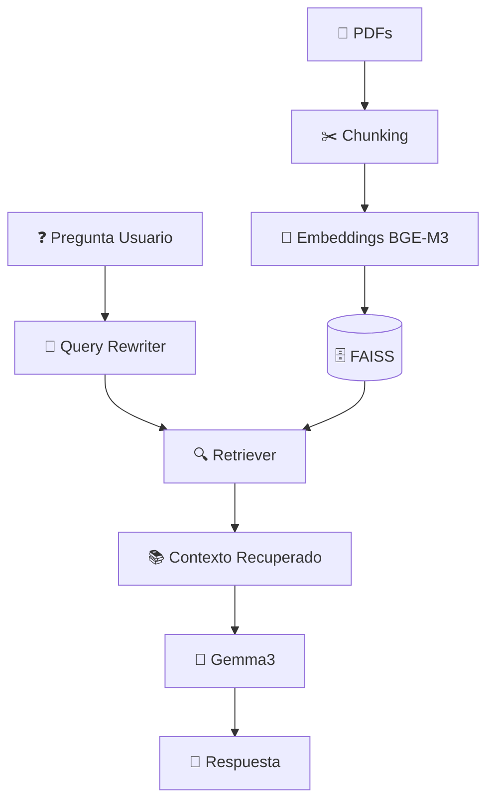
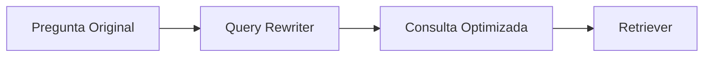
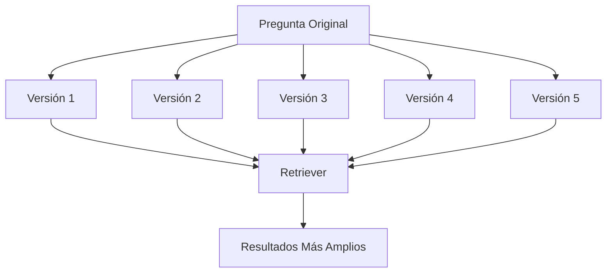
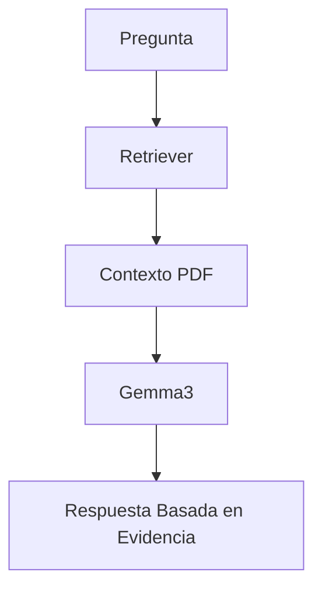

# 🤖 LangChain: Técnicas Avanzadas de RAG con LangChain, Ollama y FAISS

<div align="center">


### Explorando estrategias avanzadas para mejorar la recuperación de contexto en sistemas RAG

🧠 Query Rewriting
🔍 Multi Query Retrieval
📚 Semantic Search
⚡ Ollama Local LLMs
🗄️ FAISS Vector Database

</div>

---

# 📖 Acerca del Proyecto

Este proyecto implementa un sistema **Retrieval-Augmented Generation (RAG)** utilizando LangChain y Ollama para responder preguntas basadas exclusivamente en documentos PDF.

A diferencia de un RAG básico, aquí se exploran técnicas que buscan mejorar la recuperación semántica de información cuando las preguntas de los usuarios no coinciden exactamente con el contenido almacenado en la base vectorial.

---

# 🎯 Objetivo

Construir un asistente capaz de responder preguntas como:

> ¿Cómo solicitar el seguro de viaje?

utilizando únicamente la información contenida en documentos PDF, evitando alucinaciones y mejorando la precisión mediante técnicas avanzadas de búsqueda.

---

# 🏗️ Arquitectura General



---

# ⚙️ Stack Tecnológico

## Frameworks

* LangChain
* Ollama
* FAISS
* Hugging Face Transformers

## Modelos

### LLM

```text
gemma3:4b
```

### Embeddings

```text
bge-m3
```

---

# 📂 Flujo del Sistema

## 1️⃣ Carga de Documentos

Todos los PDFs son cargados automáticamente desde la carpeta:

```bash
documentos/
```

```python
pdfs = DirectoryLoader(
    "documentos",
    glob="*.pdf"
).load()
```

---

## 2️⃣ División Inteligente

Los documentos son fragmentados utilizando el tokenizer oficial del modelo de embeddings.

```python
CharacterTextSplitter.from_huggingface_tokenizer(
    tokenizer=tokenizer,
    chunk_size=1250,
    chunk_overlap=150
)
```

### Configuración

| Parámetro  | Valor |
| ---------- | ----- |
| Chunk Size | 1250  |
| Overlap    | 150   |

---

### Visualización

```text
Documento

┌─────────────┐
│ Chunk #1    │
└─────────────┘
      ▲
      │ overlap
      ▼
┌─────────────┐
│ Chunk #2    │
└─────────────┘
      ▲
      │ overlap
      ▼
┌─────────────┐
│ Chunk #3    │
└─────────────┘
```

---

# 🧠 Embeddings

Cada fragmento se transforma en una representación vectorial utilizando:

```python
embeddings = OllamaEmbeddings(
    model="bge-m3"
)
```

---

### Transformación

```text
Texto
      ↓

Embedding

[0.23, -0.55, 0.91, ...]
```

---

# 🗄️ Vector Store

Los embeddings son almacenados en FAISS.

```python
vector_store = FAISS.from_documents(
    documents=fragmentos,
    embedding=embeddings
)
```

---

## ¿Por qué FAISS?

✅ Búsquedas rápidas

✅ Similaridad semántica

✅ Escalable

✅ Ideal para RAG local

---

# 🔍 Técnica #1 — Query Rewriting

## Problema

Las personas preguntan de maneras diferentes.

Por ejemplo:

```text
¿Cómo solicitar el seguro de viaje?
```

```text
¿Cómo activar la cobertura de viaje?
```

```text
¿Qué beneficios tengo cuando viajo?
```

Aunque significan algo parecido, una búsqueda vectorial puede recuperar resultados distintos.

---

## Solución

Antes de buscar, el sistema genera una versión optimizada de la pregunta.



---

### Ejemplo

Pregunta original:

```text
¿Cómo solicitar el seguro de viaje?
```

Consulta optimizada:

```text
Proceso para acceder a beneficios de cobertura y asistencia durante viajes con Mastercard
```

---

## Beneficios

🎯 Mejor recuperación

🎯 Menos ruido

🎯 Más contexto relevante

🎯 Mejor matching semántico

---

# 🔍 Técnica #2 — Multi Query Retrieval

## Problema

Una sola consulta puede perder información importante.

---

## Solución

Generar múltiples perspectivas de la misma pregunta.



---

### Prompt utilizado

El modelo genera cinco preguntas alternativas.

Ejemplo:

```text
¿Cómo solicitar el seguro de viaje?

↓

¿Qué cobertura ofrece Mastercard durante viajes?

¿Cómo acceder a beneficios de asistencia internacional?

¿Qué hacer para utilizar los servicios de viaje?

¿Cómo funcionan los beneficios Travel & Lifestyle?

¿Cuáles son los requisitos para recibir asistencia durante un viaje?
```

---

## Ventajas

✅ Mayor Recall

✅ Más cobertura documental

✅ Menor dependencia de palabras exactas

✅ Mejor recuperación semántica

---

# 🤖 Generación de Respuestas

Una vez recuperado el contexto:

```python
prompt = ChatPromptTemplate(
[
("system",
"Responde usando exclusivamente el contenido incluido en el contexto"),
("human",
"{query}")
]
)
```

---

# 🔒 Grounded Generation

El modelo no responde usando conocimiento general.

Responde únicamente utilizando evidencia recuperada.



---

# 📚 Documento Utilizado

El ejemplo del proyecto utiliza una guía de beneficios Mastercard donde se encuentran servicios como:

### 🛡️ ID Theft Protection

* Monitoreo Dark Web
* Monitoreo de crédito
* Detección de credenciales comprometidas
* Especialistas de resolución

### ✈️ Travel & Lifestyle Services

* Beneficios de viaje
* Hoteles premium
* Garantía de tarifa más baja
* Asistencia de viaje

### 🌎 Mastercard Global Service

* Reemplazo de tarjetas
* Asistencia internacional
* Soporte 24/7

---

# 📁 Estructura del Proyecto

```bash
.
│
├── documentos/
│   └── beneficios_mastercard.pdf
│   └── mc_beneficios_global.txt
│   └── seguros_mc_platinum.pdf
│
├── rag.py
│
├── requirements_2.txt
│
├── .env.example
│
│
├── .gitignore
│
└── README.md
```

---

# 🔑 Variables de Entorno

```env.example
GEMINI_API_KEY=
LANGSMITH_API_KEY=
LANGSMITH_TRACING=true
```

---

# 🚀 Instalación

## Clonar repositorio

```bash
git clone https://github.com/Orliluq/LangChain.git
```

## Instalar dependencias

```bash
pip install -r requirements_2.txt
```

## Descargar modelos

```bash
ollama pull gemma3:4b
ollama pull bge-m3
```

---

# ▶️ Ejecutar

```bash
python rag.py
```

---

# 🎓 Conceptos Aprendidos

* Retrieval-Augmented Generation (RAG)
* Semantic Search
* Vector Databases
* Embeddings
* Query Rewriting
* Multi Query Retrieval
* Grounded Responses
* LangChain Pipelines
* Ollama Local Models

<div align="center">

⭐ Si te gustó el proyecto, dale una estrella al repositorio.

</div>
